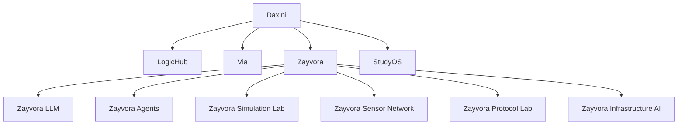

# Daxini Ecosystem

Daxini is a technology holding company structured around four major operational systems. Each system is an independent ecosystem with its own research focus, tooling, and repository structure.

## Core Systems

| System | Role |
|---|---|
| LogicHub | Prototyping engine — visual app synthesis via the GN8T [Ignite] Engine |
| Via | Decision engine tools — HCI research and prototyping laboratory |
| Zayvora | AI infrastructure ecosystem — local LLM, agents, and infrastructure AI |
| StudyOS | Learning operating system — structured knowledge and education tooling |

## Architecture Overview

## System Descriptions

### LogicHub

LogicHub is the prototyping engine of the Daxini ecosystem. It powers the GN8T [Ignite] Engine — a visual compiler for native application synthesis. Engineers use LogicHub to architect, synthesize, and export production-ready Android and web-native applications without traditional development overhead.

### Via

Via is the decision engine toolset and primary research laboratory. It focuses on human-computer interaction (HCI) prototyping, experimental spatial interfaces, and the tooling that powers developer workflows across the Daxini ecosystem.

### Zayvora

Zayvora is the AI infrastructure ecosystem. It is designed to power intelligence at the edge — running AI locally inside physical infrastructure, sensor networks, and constrained environments where cloud dependency is not viable.

Zayvora is structured into six research layers:

| Layer | Purpose |
|---|---|
| Zayvora LLM | Local large language model systems |
| Zayvora Agents | Autonomous agent framework |
| Zayvora Infrastructure AI | AI embedded in physical infrastructure |
| Zayvora Simulation Lab | Infrastructure scenario simulation |
| Zayvora Protocol Lab | Communication protocol experimentation |
| Zayvora Sensor Network | Distributed sensor intelligence |

See [Zayvora Architecture](/site/zayvora/architecture.md) for detailed system design.

### StudyOS

StudyOS is the learning operating system within the Daxini ecosystem. It provides structured knowledge frameworks, educational tooling, and learning infrastructure for engineering and research disciplines.

## Ecosystem Principles

All systems within the Daxini ecosystem share common engineering principles:

- **Zero Dependency**: No third-party package managers. Maximum security and longevity.
- **Vanilla Implementation**: Native JavaScript, HTML5, and CSS3 where applicable.
- **Edge Deployment**: Sub-100ms latency via Vercel Edge Network.
- **Cross-Platform**: Uniform execution across Mobile, Tablet, Desktop, and Smart TV.

## Navigation

- [Zayvora](/zayvora) — AI infrastructure ecosystem
- [Zayvora Architecture](/site/zayvora/architecture.md)
- [Zayvora Roadmap](/site/zayvora/roadmap.md)
- [Zayvora Research](/docs/zayvora-research.md)
